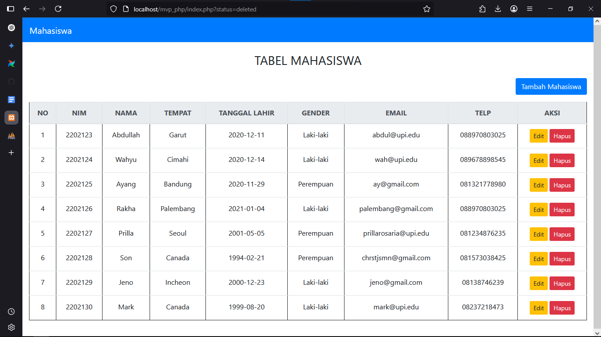
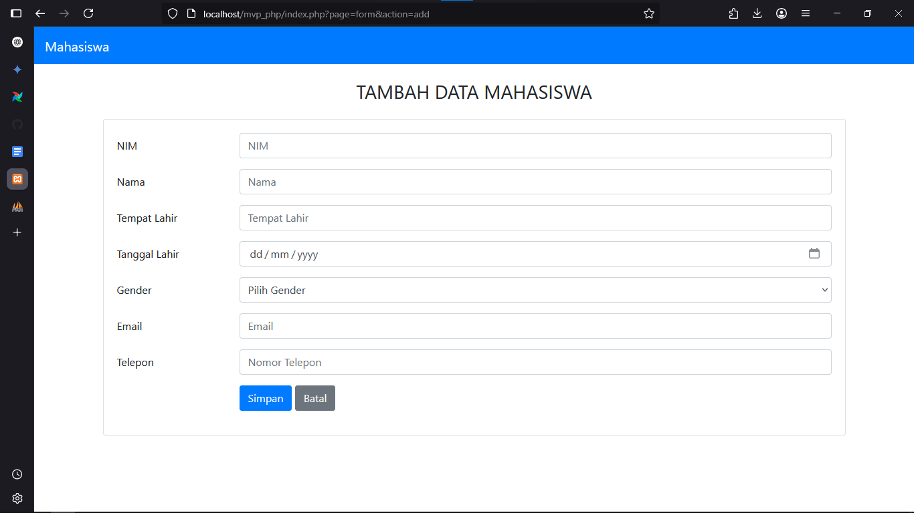
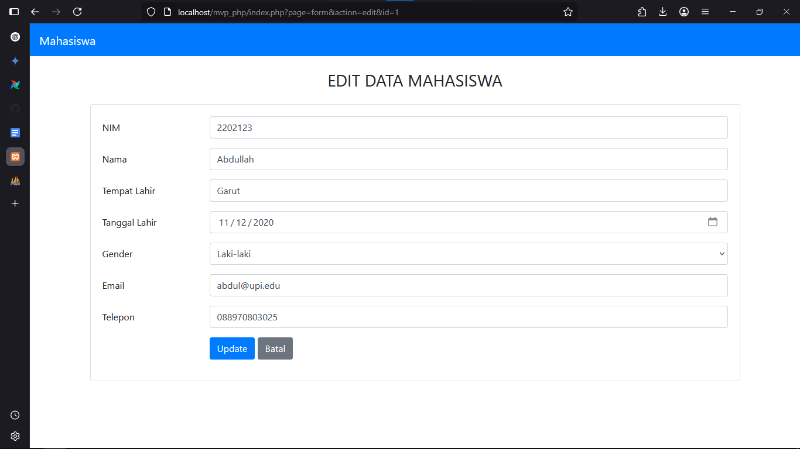

# Janji
Saya Putra Hadiyanto Nugroho dengan NIM 2308163 mengerjakan Tugas Praktikum Latihan 9 dalam mata kuliah Desain dan Pemrograman Berorientasi Objek untuk keberkahanNya maka saya tidak melakukan kecurangan seperti yang telah dispesifikasikan. Aamiin.


# Deskripsi Singkat Program

Program ini adalah aplikasi berbasis web untuk mengelola data mahasiswa. Aplikasi ini memungkinkan pengguna untuk:

1. **Melihat Data Mahasiswa**: Menampilkan daftar mahasiswa dalam bentuk tabel.
2. **Menambah Data Mahasiswa**: Mengisi form untuk menambahkan data mahasiswa baru ke dalam database.
3. **Mengedit Data Mahasiswa**: Memperbarui informasi mahasiswa yang sudah ada melalui form edit.
4. **Menghapus Data Mahasiswa**: Menghapus data mahasiswa dari database.

Aplikasi ini menggunakan arsitektur Model-View-Presenter (MVP) untuk memisahkan logika bisnis, tampilan, dan pengelolaan data. Berikut adalah teknologi yang digunakan:

- **PHP**: Untuk logika backend dan pengelolaan data.
- **HTML & CSS**: Untuk tampilan antarmuka pengguna.
- **Bootstrap**: Untuk desain responsif dan komponen UI.
- **MySQL**: Sebagai basis data untuk menyimpan informasi mahasiswa.

# Struktur Folder Projek

Berikut adalah struktur folder untuk proyek ini:

```
index.php
mvp_php.sql
process.php
readme.md
model/
	DB.class.php
	Mahasiswa.class.php
	TabelMahasiswa.class.php
	Template.class.php
presenter/
	KontrakPresenter.php
	ProsesMahasiswa.php
templates/
	form.html
	skin.html
view/
	KontrakView.php
	TampilMahasiswa.php
```

# Desain Program

Program ini dirancang menggunakan arsitektur **Model-View-Presenter (MVP)** untuk memisahkan logika bisnis, tampilan, dan pengelolaan data. Berikut adalah penjelasan dari setiap komponen:

## 1. Model
- **Fungsi**: Bertanggung jawab untuk mengelola data dan berinteraksi dengan database.
- **File Terkait**:
  - `DB.class.php`: Kelas untuk koneksi database menggunakan PDO.
  - `Mahasiswa.class.php`: Kelas untuk representasi data mahasiswa.
  - `TabelMahasiswa.class.php`: Kelas untuk operasi CRUD pada tabel mahasiswa.

## 2. View
- **Fungsi**: Bertanggung jawab untuk menampilkan data kepada pengguna dan menerima input dari pengguna.
- **File Terkait**:
  - `KontrakView.php`: Interface untuk view.
  - `TampilMahasiswa.php`: Kelas view untuk menampilkan data mahasiswa dalam tabel atau form.
  - `templates/`: Folder yang berisi template HTML (`form.html` dan `skin.html`).

## 3. Presenter
- **Fungsi**: Bertindak sebagai penghubung antara model dan view. Presenter mengambil data dari model dan memformatnya untuk ditampilkan oleh view.
- **File Terkait**:
  - `KontrakPresenter.php`: Interface untuk presenter.
  - `ProsesMahasiswa.php`: Kelas presenter untuk mengelola data mahasiswa.

## Alur Program
1. **Melihat Data Mahasiswa**:
   - `index.php` memanggil `TampilMahasiswa` untuk menampilkan tabel mahasiswa.
   - `TampilMahasiswa` menggunakan `ProsesMahasiswa` untuk mengambil data dari `TabelMahasiswa`.
   - Data ditampilkan menggunakan template `skin.html`.

2. **Menambah Data Mahasiswa**:
   - Pengguna mengakses form melalui `index.php?page=form&action=add`.
   - `TampilMahasiswa` menampilkan form menggunakan template `form.html`.
   - Data yang diinputkan dikirim ke `process.php?action=add` untuk disimpan ke database melalui `ProsesMahasiswa`.

3. **Mengedit Data Mahasiswa**:
   - Pengguna mengakses form melalui `index.php?page=form&action=edit&id=<id>`.
   - `TampilMahasiswa` mengambil data mahasiswa berdasarkan ID dan menampilkannya di form.
   - Data yang diubah dikirim ke `process.php?action=update` untuk diperbarui di database melalui `ProsesMahasiswa`.

4. **Menghapus Data Mahasiswa**:
   - Pengguna mengklik tombol hapus pada tabel.
   - Permintaan dikirim ke `process.php?action=delete&id=<id>` untuk menghapus data dari database melalui `ProsesMahasiswa`.

# Dokumentasi

### Tampilan Awal


### Tampilan Create


### Tampilan Edit


### Screenrecord

